# Ethan K.'s TypeScript Portfolio

A TypeScript React app used as my portfolio.

- Author: Ethan Kletschke
- Version: `2.9.0`
- Development Environment: Ubuntu (WSL)
  - Initially tested on MS Edge, mostly tested on Mozilla Firefox
    - Screenshots taken from output on Firefox
    - Please let me know about any styling abnormalities
      on Webkit browsers (Especially Safari)
- Technologies used:
  - NPM
  - Node.js
  - React (TypeScript)
  - Vite
  - Windows Subsystem for Linux (WSL)
  - ChatGPT _**(for problem-solving and ideas only)**_
- License: Modified MIT (See below)

As of version 0.22.0, this project is licensed under a modified MIT License that
prohibits AI training. Previous versions remain under the standard MIT License.

## Table of Contents

- [Ethan K.'s TypeScript Portfolio](#ethan-ks-typescript-portfolio)
  - [Table of Contents](#table-of-contents)
  - [About the App](#about-the-app)
    - [Disclaimer About Me Testing the App](#disclaimer-about-me-testing-the-app)
    - [Features](#features)
    - [Planned Features](#planned-features)
  - [Using the App](#using-the-app)
    - [Requirements to Run](#requirements-to-run)
    - [Installation](#installation)
    - [Running the App](#running-the-app)
  - [Pages](#pages)
    - [About Me](#about-me)
    - [Cards Demo (WIP)](#cards-demo-wip)
    - [Consecutive Summation](#consecutive-summation)
    - [Custom Email Validator](#custom-email-validator)
    - [Stopwatch Page](#stopwatch-page)
    - [Numeric Acronym Generator](#numeric-acronym-generator)
    - [Letter Repetition](#letter-repetition)
    - [Sentence Sorting](#sentence-sorting)
    - [Dice Roll](#dice-roll)
    - [Object Sort](#object-sort)
    - [Dialog Box Demo](#dialog-box-demo)
  - [Credits](#credits)

## About the App

This is a portfolio app written purely in TypeScript and React. The backend and
frontend are purely just React. No databases or server involved.

This app has a few pages that demonstrate different concepts and ideas I wanted
to program. The app is also fully styled. Each page is described briefly in this
README.

### Disclaimer About Me Testing the App

Over the course of developing this app since I started it in October 2025, I
initially tested it on Microsoft Edge, as it was my main browser at the time. I
have since moved to Mozilla Firefox, so 99% of the time, I just test on there.
It's not guaranteed that I test my app on MS Edge unless I do cross-browser
styling with CSS prefixes (i.e., `-moz-` and `-webkit-`).

Furthermore, I haven't tested the app at all on any mobile platform as of yet,
as I can't get Vite to properly expose itself on my home network to properly
test on my phone as I program the app. If you have any suggestions on how to fix
this, or even if you cloned the app and tested it on mobile yourself, please
email me below and mark it as an urgent email, especially if it regards any fix
I should work on:

<a href="mailto:ethankletschke@outlook.com">ethankletschke@outlook.com</a>

### Features

- Comprehensive styling via CSS
- User interface made up almost entirely of custom components
- A "toast system" for small, brief site notifications
- Mocha testing

### Planned Features

- Full Jest testing
- A page with a styled &lt;select&gt; element (combo box)
- An advanced modal example demonstrating the use of `forwardRef()`.

## Using the App

### Requirements to Run

- NPM v11 and above
- Node.js v22 and above

### Installation

1. Clone the repository.
2. Use `cd` to navigate to the repository folder
3. Run `npm install` to download all the dependencies.

### Running the App

For the heavily tested "dev" version:

1. Run `npm run dev` via a terminal in the project folder. This will run Vite's 
   development server in the terminal.
2. Type `o` and press enter to open the app in your browser.

For the seemingly identical production version:

1. Run `npm run build` to build the production version of the app.
2. Run `npm run preview` to run the built production app.
3. Type `o` and press enter.

I suggest just running the dev server, because this is quicker and easier to do.

## Pages

Unless otherwise specified, all ideas were conceived by me.  
The home page shown below features links to each of the pages discussed in this
section.

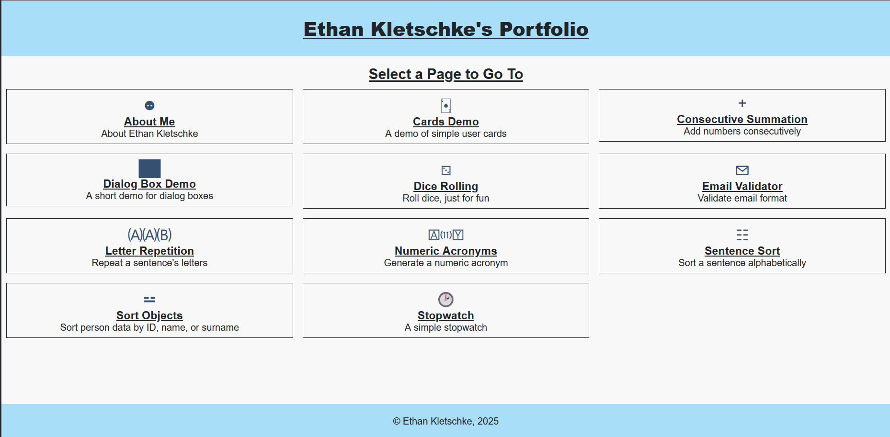

### About Me

A page discussing me and my confidence in my skills. The skills are displayed as
a meter from 1% to 100%.

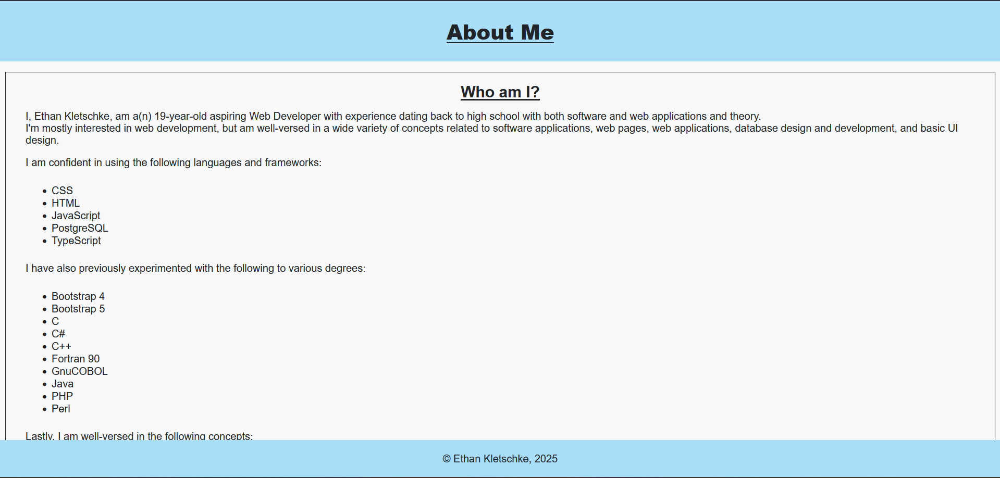

### Cards Demo (WIP)

A small page demonstrating fully styled "Card" components, currently only basic
cards about famous landmarks.

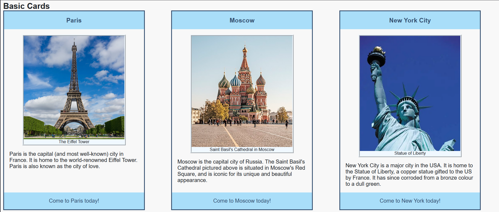

### Consecutive Summation

On this page, you can input a number to add to a previous number (starting at 0)
with each button press, and you can optionally add a "step" (how many times
to add the same number).  
For example, setting the number as 2 and the step as 2 will add 4 to the number. 

The formula is as follows:

$$
val = val + (new \times step) 
$$

Where:

- "`val`" is the current value (initially 0).
- "`new`" is the number the user provided.
- "`step`" is the step provided by the user.

Example of output:

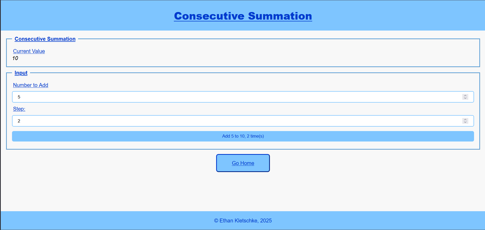

### Custom Email Validator

On this page, you can validate an entered email address, and the app will 
automatically validate the email as you type it using a custom RegEx instead of 
the browser's built-in `email` input validator. Supports `email` autocomplete.

Example of output:

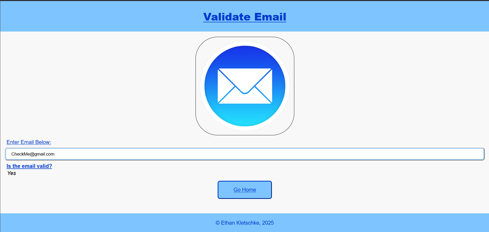

### Stopwatch Page

_Idea Credit: ChatGPT_

A simple page containing a stopwatch (measured in seconds only) 
and a time log for it.

Example of output on Firefox:

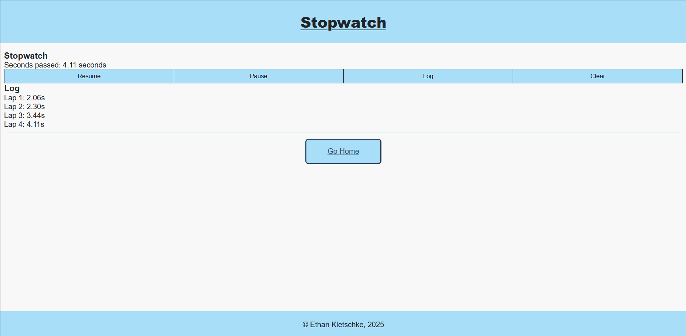

### Numeric Acronym Generator

A page that generates a numeric acronym out of a word.  
A numeric acronym is an abbreviation of a word (especially in IT
documentation) that is made up of the word's first letter,
its last letter, and the number of characters in between the
first and last letters.  
For example, `accessibility` would become `a11y`.

Example of output for `internationalisation`:

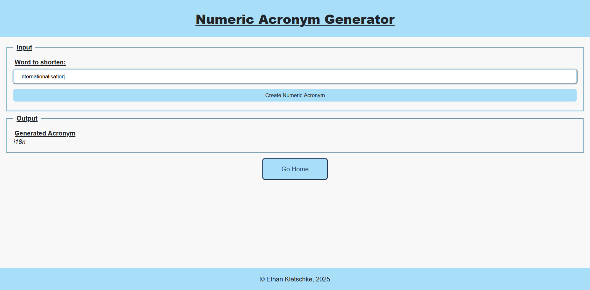

### Letter Repetition

_Idea Credit: My hilariously slow phone_

A simple page that just takes a word and builds a new string where each 
word's character is repeated up to its index in the word.  
For example, `hey there buddy` will become
`hheheytththethertherebbubudbuddbuddy`.

Example of Output:

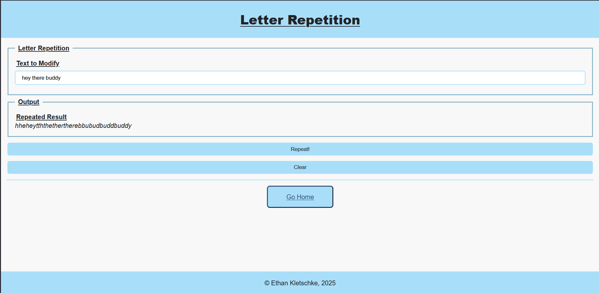

### Sentence Sorting

On this page, you can enter a sentence, and the program will sort that sentence
by its individual letters (case- and accent-insensitive).  
For example, `Letters` would be sorted as `eeLrstt`.

Example of Output:

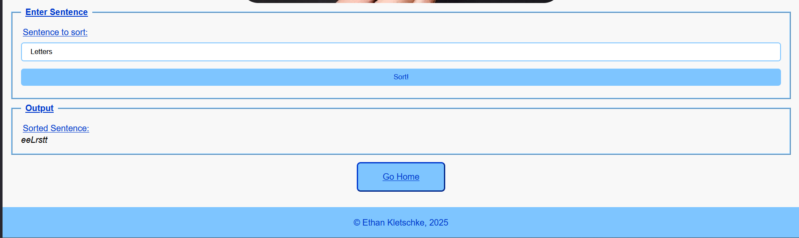

### Dice Roll

When you click on a button, rolls the die, and displays the die face, along with
averages and totals for your roll streak.

Example of Output:

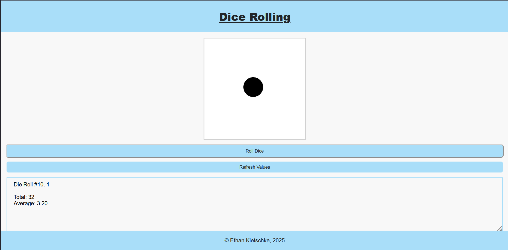

### Object Sort

Input four text values, store it internally as an object, and sort the objects
by one of the four text values.

Output for `Create` (after 2 objects are created):

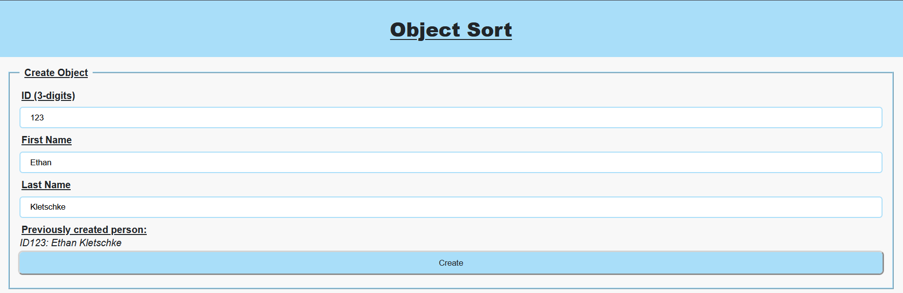
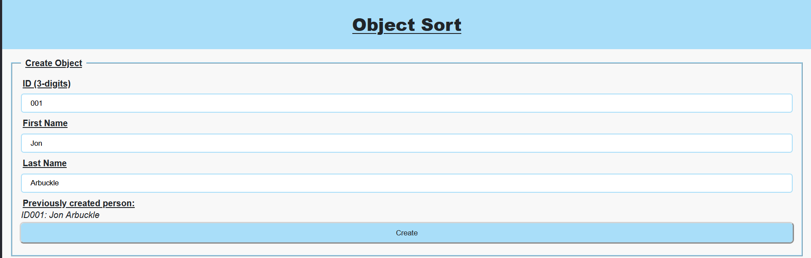

Output for `Sort` after choosing to sort by last name:

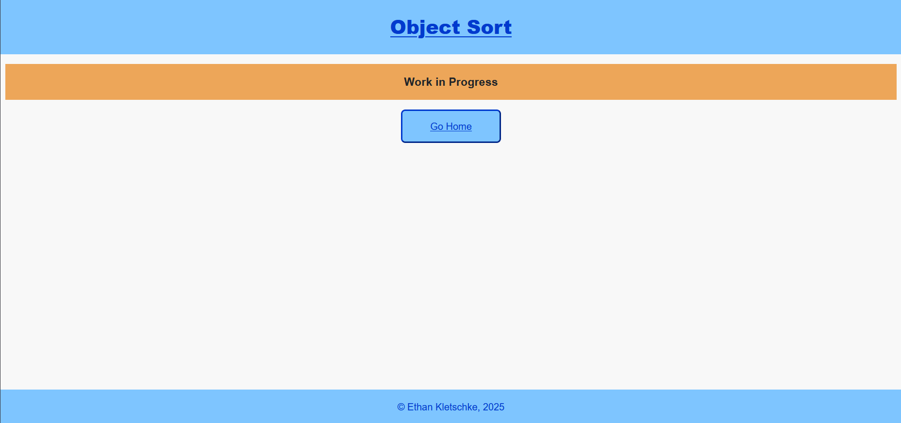

Output after clearing:

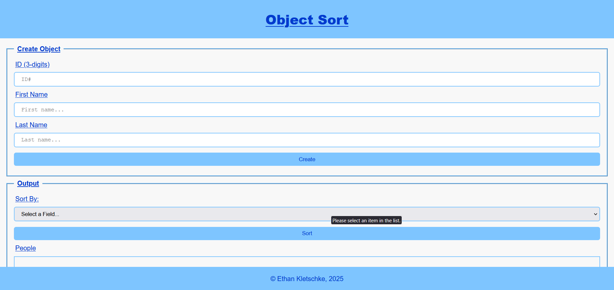

### Dialog Box Demo

A small page demonstrating fully-styled dialog boxes of 3 types:

1. Alert Box
   - A box with a short message and an "OK" button.
2. Confirm Box
   - A box with a short confirmation message, along with "Yes" and "No" buttons.
3. Form Box
   - A confirm box with a simple form.

Page by Default:

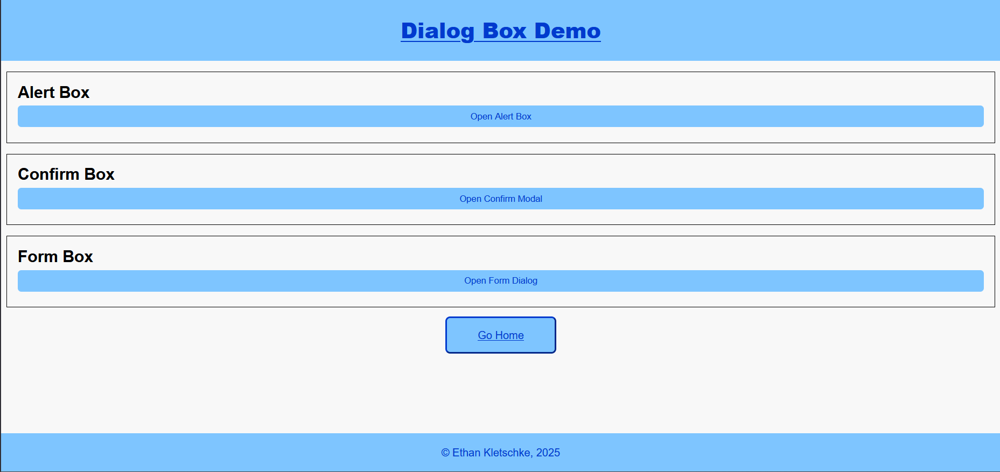

After opening the alert box:

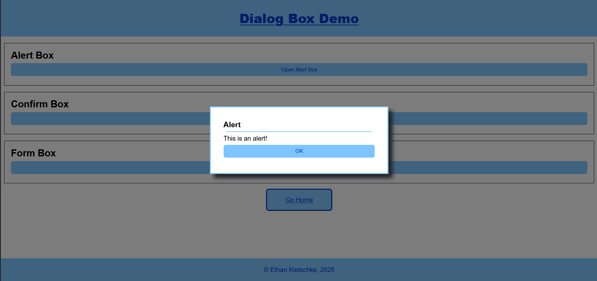

## Credits

- W3Schools helped as a brief guide/refresher.
- MDN Web Docs helped for more detailed explanations and guides.
- ChatGPT helped for a couple ideas and _**some**_ problem solving.
- Special thanks to:
  - Sabrielle, my girlfriend, for the continued support and for helping me with
    colour scheme tips (love you bae! &hearts;)
